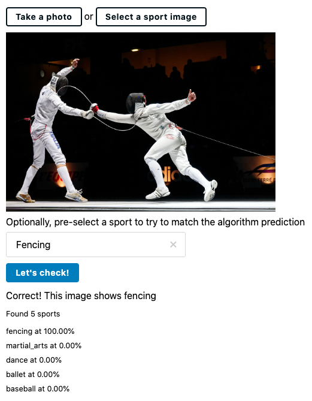

# Sport Visioner
A sample sport-detection application based on the [Sport Vision API](https://developers.decathlon.com/products/sport-vision) from [Decathlon](https://www.decathlon.com/).

The application allows the user to take a photo or pick a local image, and predict what sport(s) are included in the picture. The user can optionally pre-select a sport to try to match the algorithm prediction.



# Development
First you will need [Node.js](https://nodejs.org/) (latest LTS version recommended, v14 at time of writing).
The application is developed with [Vite](https://vitejs.dev/).
The UI is built with [Svelte](https://svelte.dev/) and the [Decathlon design system](https://www.decathlon.design/) (see also [github.com/vitamin-web](https://github.com/decathlon/vitamin-web))

After cloning this repository, run `npm install` to install dependencies,
and add your API key as described below.

This application requires a Decathlon API key, you can get one on the [Decathlon developers site](https://developers.decathlon.com/). Once you have a key, configure it in a git-ignored `.env.local` file, for example:
```
VITE_DECATHLON_API_KEY=abcd1234
```

Available npm commands:
- `npm run dev` to run a local dev server
- `npm run serve` to run bundled locally
- `npm run test` to run unit tests
- `npm run test:watch` to run unit tests in watch mode
- `npm run build` to bundle for production

## Testing
Unit tests are written with [Testing Library](https://testing-library.com/) and [Vitest](https://vitest.dev/).

# License
This project is licensed under the MIT License. See [LICENSE](LICENSE) for more information.
